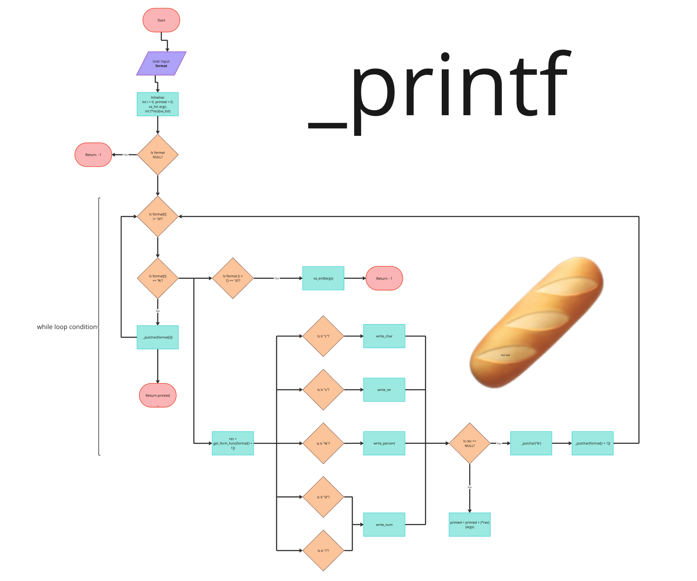

<h1 align="center">하나, 둘 _printf</h1>

<div id="header" align="center">
  
</div> 

## About The Project

_Put your sneakers on,_

_하나, 둘, ready, get set, go_ __printf_

This project will touch people's hearts _twice_: once through the ears, and once again through the eyes.

A simple recreation of the standard library printf function with the following conversion specifiers:

| Specifier | Description |
|-----------|---------|
| `c` | character |
| `s` | string |
| `%` | percent on its own (not modifier) |
| `d` | decimal |
| `i` | integer |


## Table of Contents
<details>
	<summary>Table of Contents</summary>
	<ol>
	<li>
	<a href="#requirements">Requirements</a>
	</li>
	<li>
	<a href="#repository-contents">Repository Contents</a>
	</li>
	<li>
	<a href="#getting-started">Getting Started</a>
		<ul>
		<li><a href="#installion">Installation</a></li>
		<li><a href="#man-page">Man page</a></li>
		</ul>
	</li>
	<li>
	<a href="#usage">Usage</a>
		<ul>
		<li><a href="#output-examples">Output Examples</a></li>
		<li><a href="#flowchart">Flowchart</a></li>
		</ul>
	</li>
	<li>
	<a href="#authors">Authors</a>
	</li>
	</ol>
</details>


## Requirements

- Ubuntu 20.04 LTS
- Follows the betty linter style and documentation
- No global variables can be used
- No more than five functions per file

## Repository Contents

| File | Description |
|------|-------------|
| `_printf.c` | A function that prints anything similar to standard library `printf` |
| `_putchar.c` | A function that prints a char using `write` similar to standard library `putchar` |
| `form_func.c` | A compilation of all functions needed for the conversion specifiers of `_printf` |
| `get_form_func.c` | A function that determines which format specifier function to call |
| `main.h` | A header file containing the prototypes and `typedef struct what_format` |


## Getting Started
To get a local copy up and running on your own machine follow these simple steps:


### Installation
- Clone this repository


```
git clone https://github.com/hewsontrinh526/holbertonschool-printf

```

- Compile using the below:


```
$ gcc -Wall -Werror -Wextra -pedantic -std=gnu89 -Wno-format *.c
```


### Man page

Call the manual to read how `_printf` works:

```
man ./man_3_printf

```


## Usage

`_printf("user input here")`

### Output examples

User input:

```
_printf("Oui Oui Baguette\n");
_printf("Should print a single percent sign: %%\n");
_printf("Character:[%c]\n", 'H');
_printf("String:[%s]\n", "I am a string !");
_printf("%d + %d = %d\n", INT_MIN, INT_MAX, (INT_MIN + INT_MAX))
_printf("%i\n", INT_MIN);

```
Expected output:

```
Oui Oui Baguette
Should print a single percent sign: %
Character:[H]
String:[I am a string !]
-2147483648 + 2147483647 = -1
-2147483648

```

### Flowchart




## Authors
- [Hewson Trinh](https://github.com/hewsontrinh526)
- [Chelsey Chia](https://github.com/chelseyqc)

`viola`

